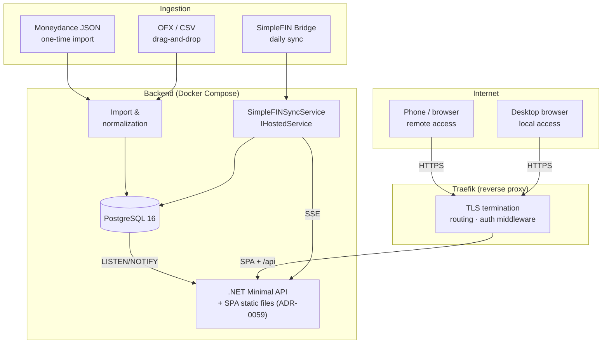
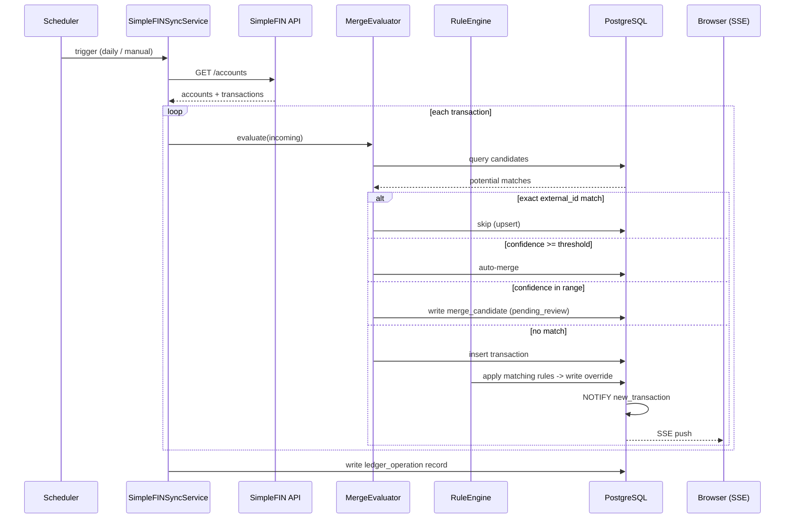
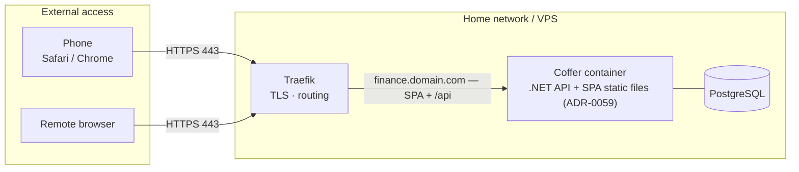
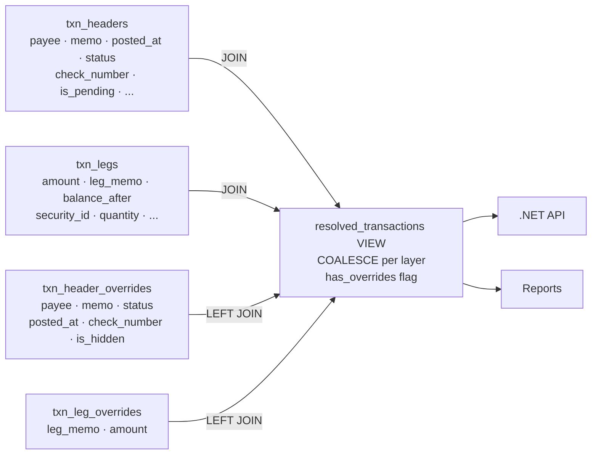
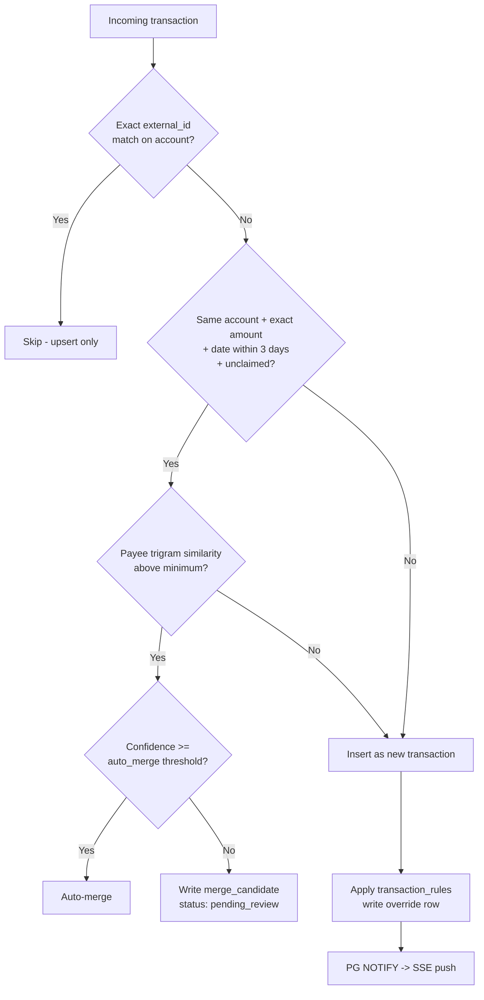
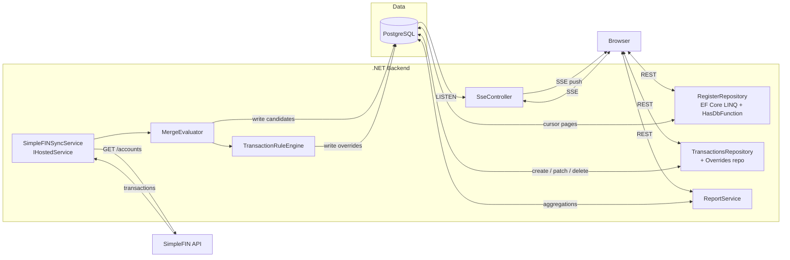
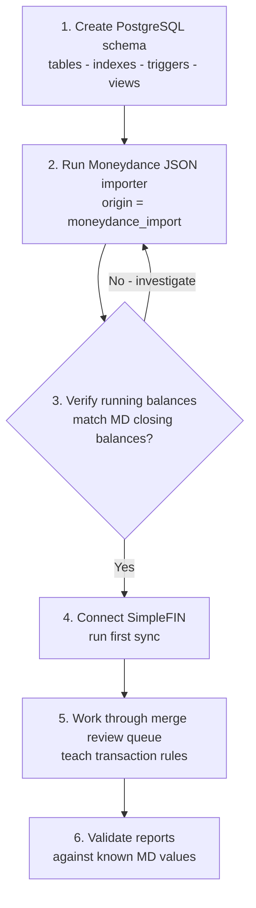

# Coffer — Architecture & Design Reference

*A self-hosted Moneydance replacement built on .NET + PostgreSQL.*

**Source of truth.** This document is the authoritative high-level design.
Deviations are captured in [decisions/](decisions/) (ADRs) and in implementation-level
docs ([database-schema.md](database-schema.md), [operations.md](operations.md)).

---

## Table of Contents

1. [Project Overview](#1-project-overview)
2. [System Architecture](#2-system-architecture)
3. [Data Model](#3-data-model)
4. [Transaction Override Layer](#4-transaction-override-layer)
5. [Transaction Merge Pipeline](#5-transaction-merge-pipeline)
6. [Implementation Notes](#6-implementation-notes)
7. [Moneydance Migration Plan](#7-moneydance-migration-plan)
8. [Build Sequence](#8-build-sequence)

---

## 1. Project Overview

Coffer is a self-hosted personal finance application intended to replace Moneydance.

### 1.1 Goals

- Replace Moneydance and the Moneydance+ Plaid feed with a self-hosted, containerized alternative
- Preserve years of historical Moneydance data with full fidelity
- Provide a contemporary web-based UI with interactive reports
- Maintain a proper double-entry accounting model matching Moneydance's internal design
- Support live bank feed sync via SimpleFIN Bridge
- Handle investment accounts, holdings, and tax-lot tracking
- Support multiple users with per-ledger access roles (owner / editor / viewer), member + admin management, and invite links (ADR-0083, delivered 0.34.0)

### 1.2 Non-goals (deferred)

- Native mobile apps (the SPA is responsive; no native app)
- Direct OFX/direct-connect banking (SimpleFIN covers this)
- Tax-lot selection UI (schema supports it; UI deferred)

### 1.3 Technology stack

| Layer | Technology |
|---|---|
| Backend API | **.NET 10** (LTS) — Minimal API style. See [decisions/0011-target-dotnet-10.md](decisions/0011-target-dotnet-10.md). |
| ORM / data access | **EF Core end-to-end** in the API (LINQ for queries; `HasDbFunction` for complex Postgres functions; `ExecuteUpdate`/`ExecuteDelete` for set-based mutations). Dapper stays in the importer for its bulk-insert hot path. See [decisions/0005-dapper-and-efcore.md](decisions/0005-dapper-and-efcore.md) as realigned in PR 3.6.5. |
| Database | PostgreSQL 16+ |
| Caching | None. Redis was provisioned but never wired and was removed in v0.5.0; the product is single-instance self-hosted. A cache (report/balance, or a distributed sync lock) is a later call if a multi-instance shape ever lands. |
| Real-time | Server-Sent Events (SSE) via `System.Net.ServerSentEvents`; plain HTTP `POST` for commands; PG `LISTEN`/`NOTIFY` internally. **No SignalR / WebSockets.** See [decisions/0012-sse-and-plain-http-no-signalr.md](decisions/0012-sse-and-plain-http-no-signalr.md). |
| Authentication | WebAuthn / FIDO2 passkeys (YubiKey, Windows Hello, Touch ID, phone) via `Fido2.AspNet`; multi-credential per account; one-time recovery codes; cookie session. See [decisions/0013-webauthn-passkey-auth.md](decisions/0013-webauthn-passkey-auth.md). |
| API documentation | Built-in OpenAPI generator (`Microsoft.AspNetCore.OpenApi`, .NET 10 in-box) |
| Frontend | Vite + React + TypeScript + Tailwind v4 + TanStack Query + TanStack Router + react-virtuoso. UI primitives are hand-rolled in the shadcn/ui idiom (`class-variance-authority` + `cn(twMerge(clsx))`), not pulled via the shadcn CLI — see ADR-0021 + `src/Web/src/components/ui/` for the in-repo primitives (Button, Typeahead, ContextMenu, ConfirmDialog, StatusBadge, etc.). |
| Charts | Recharts / Nivo — fully interactive, drillable (Phase 8) |
| Containerization | Docker Compose — postgres + the single-container api/spa (ADR-0059) |
| Reverse proxy | Traefik — TLS termination, routing, internet-accessible |
| Bank feed | SimpleFIN Bridge (via MX) — $15/year, up to 25 institutions |

> **Frontend choice rationale:** Vite + React SPA was chosen over Next.js because Next.js's primary value propositions (SSR, SSG, full-stack deployment) add complexity without benefit for a single-user app backed by a dedicated .NET API. The SPA builds to static files served via Traefik or directly from the .NET app as static middleware. See [decisions/0007-react-spa-over-nextjs.md](decisions/0007-react-spa-over-nextjs.md).

---

## 2. System Architecture

### 2.1 Three-layer overview



### 2.2 Real-time / streaming

Two patterns, picked for the actual usage shape (single user, server-pushed sync events, button-triggered actions). See [decisions/0012-sse-and-plain-http-no-signalr.md](decisions/0012-sse-and-plain-http-no-signalr.md) for the trade-off analysis.

| Pattern | Use case |
|---|---|
| **Server-Sent Events** (`text/event-stream` via `System.Net.ServerSentEvents`) | Every server-to-browser stream: sync progress, new-transaction notifications, pending-review-count updates. |
| **Plain HTTP `POST`** | Every browser-to-server command, including manual sync triggers. Combined with the SSE channel above, this covers what some apps reach for SignalR to do. |
| **PostgreSQL `LISTEN`/`NOTIFY`** | Backend pub/sub — sync worker publishes to a channel; API controller subscribes via Npgsql and fans out to SSE clients. |

**No SignalR, no WebSockets.** SignalR's strengths (multi-client fan-out, transport negotiation, backplane) are sized for many users on flaky networks across multiple replicas, which Coffer is not. The "bidirectional" interaction in this app is a command followed by a streamed status — natively HTTP-shaped.

### 2.3 Sync pipeline flow



### 2.4 Bank feed — SimpleFIN

SimpleFIN Bridge is the chosen feed provider. Key characteristics:

- Cost: $1.50/month or $15/year
- Supports up to 25 institutions and 25 apps
- Daily polling — not real-time; appropriate for personal finance
- Uses MX as upstream aggregator
- A major brokerage is supported via proper OAuth (migrated February 2025 — no screen-scraping)
- Hardware key (YubiKey) MFA requires periodic re-auth — OAuth token persists until expiry then prompts user
- SimpleFIN returns account balances, transactions, and holdings (including security positions) for investment accounts

See [decisions/0006-simplefin-over-plaid.md](decisions/0006-simplefin-over-plaid.md) for the comparison vs Plaid.

> **Note:** Design the app to gracefully handle a 'needs re-auth' state for the brokerage. Surface it clearly in the UI and make re-auth a one-click prompt rather than a silent failure.

### 2.5 Deployment — localhost, or a reverse proxy for remote access

Two supported shapes, chosen at install time. **One machine** is the default and a
complete deployment: `http://localhost` on the host, nothing published beyond it, every
feature working. The diagram below is the **other** shape — opt-in remote access, where
a reverse proxy (Traefik here) terminates TLS so the same install is reachable from a
phone or a browser outside the home network. Nothing in the architecture requires it.



> **SSE buffering:** The `X-Accel-Buffering=no` header on the API router is required. Without it Traefik buffers SSE responses and the real-time sync feed loses its low-latency behaviour.

### 2.6 Authentication

Authentication and network posture are independent concerns. The app enforces auth in every environment regardless of how it's exposed (LAN-only, VPN, public-internet behind a reverse proxy). Network posture is a deployment decision documented in [operations.md](operations.md).

The chosen scheme is **WebAuthn / FIDO2 passkeys**, fully detailed in [decisions/0013-webauthn-passkey-auth.md](decisions/0013-webauthn-passkey-auth.md). Summary of the user-visible model:

| Element | Behaviour |
|---|---|
| Primary credentials | Any FIDO2 authenticator: YubiKey (USB / NFC), Windows Hello, Touch ID / Face ID, Android passkey, iPhone passkey. |
| Multiple credentials per account | No upper bound. Each is nicknamed by the user and labelled by AAGUID + transports in the UI. |
| Recovery codes | 10 single-use, Argon2id-hashed at setup. Each unlocks one re-registration. Regeneratable from an authenticated session. |
| Bootstrap (first run) | API logs a one-time setup token on first start while no credentials exist; the operator shares `/setup/{token}` (`dev-up-docker.sh` prints it). The setup page fetches `GET /api/auth/setup/{token}/info` on mount purely to validate the token — it returns no ledger list (ADR-0088) — then the user supplies a username, display name and passkey label, and optionally ticks **Include a Demo ledger**, before the WebAuthn ceremony. `/complete` returns plaintext recovery codes once; the SPA shows Copy / Download .txt / Print affordances and gates the post-setup navigation to the ledger hub (`/`) behind explicit acknowledgement. Setup creates no ledger unless Demo was requested. |
| Sessions | Cookie-based (`HttpOnly`, `Secure`, `SameSite=Strict`); 30-day max lifetime, 7-day idle timeout, multi-session, "sign out everywhere" available. |
| Library | [`Fido2.AspNet`](https://github.com/passwordless-lib/fido2-net-lib) on the server side. |

**Key property: works fully offline.** The auth ceremony is server ↔ browser ↔ device crypto; no IdP is in the path. A WAN outage does not prevent fresh login from a LAN- or VPN-reachable client.

The .NET API enforces authentication directly (the API is *not* auth-naive). A `Development`-only handler bypass is gated by `Api:DevAuth=true` plus `ASPNETCORE_ENVIRONMENT=Development`, and only authenticates a request that also sends the opt-in header `X-Dev-Auth: 1` — so it never hijacks a real cookie session. The production build path always validates real WebAuthn assertions.

### 2.7 Mobile (phone browser) considerations

The Vite + React SPA works in Safari on iOS and Chrome on Android without any native app. Key design decisions for mobile:

- **Register layout:** a dense spreadsheet-style column grid is unusable on a narrow screen. Use a responsive layout that switches to a card-per-transaction view (amount + payee + date + category) at narrow viewports. react-virtuoso works correctly in both layouts.
- **Touch targets:** shadcn/ui components are touch-friendly by default. Ensure action buttons (categorize, hide, split) have minimum 44px touch targets.
- **Reports / charts:** Recharts is fully responsive via the `ResponsiveContainer` wrapper. No extra work needed.
- **Merge review queue:** the side-by-side comparison view needs to stack vertically on mobile — design as a column layout with a clear "match" / "no match" action bar at the bottom of the screen.

---

## 3. Data Model

### 3.1 Core principle — unified accounts table

Moneydance is a genuine double-entry accounting system. Confirmed by Moneydance support: *"Categories are accounts. They are accounts with type income or expense."* When a $100 grocery transaction is recorded in checking, Moneydance creates a corresponding entry in the Groceries expense account.

**Consequence for schema design:** there is one `accounts` table. "Categories" (income/expense) are rows in that table with the appropriate `account_type`. Splits reference accounts by FK — not a separate categories table. See [decisions/0002-unified-accounts-table.md](decisions/0002-unified-accounts-table.md).

### 3.2 Account types

| `account_type` | Description |
|---|---|
| `bank` | Checking, savings, money market |
| `credit_card` | Credit cards — balance represents current debt |
| `investment` | Brokerage, IRA, 401k — the cash-side parent. Per-security positions live in `holdings`, not in `accounts`. |
| `asset` | Property, vehicles, other assets |
| `liability` | Generic liabilities without amortization (e.g. money owed to a person) |
| `loan` | Amortizing loans (mortgages, auto loans) — distinct from `liability` because loans carry payment-schedule metadata (APR, term, compounding). See [decisions/0016-moneydance-account-translation.md](decisions/0016-moneydance-account-translation.md). |
| `category` | Budgeting concept — the "other side" of income/spending transactions. The income-vs-expense distinction lives in `category_kind`, not in this column. See [decisions/0017-account-discriminator.md](decisions/0017-account-discriminator.md). |

`category_kind` is `'income'` or `'expense'`, set if and only if `account_type = 'category'`.

**Hierarchy.** `parent_id` is a self-referencing FK and is only allowed on `category` rows (enforced by CHECK constraint). Real-account hierarchy (e.g. a placeholder "Checking" parent grouping two same-bank checking accounts in MD's data) is **not** modelled; those become flat top-level accounts. Categories form a tree freely — a parent category can have its own direct transactions and child categories, both, or neither. There is no `is_placeholder` column; the "this is just a folder" property is derived in the UI as "has children AND no own transactions".

**Investment account hierarchy.** MD models per-security positions as `acct` rows of type `s` parented to the brokerage account. In our schema those become rows in `holdings`, not in `accounts` — see [decisions/0016-moneydance-account-translation.md](decisions/0016-moneydance-account-translation.md).

**Per-brokerage Holdings sibling.** Every `account_type='investment'` row gets a system-managed sibling account at the root that hosts the holdings-side legs of investment transactions (the asset side of buys, sells, dividend reinvests, etc.). The brokerage row points at it via `holdings_account_id`; the sibling carries `is_system=TRUE` and is hidden from the user's account list by default. This pattern keeps the *parent-only-for-categories* invariant intact while giving each brokerage a paired account for the symmetric posting model. See [decisions/0019-symmetric-postings.md](decisions/0019-symmetric-postings.md).

### 3.3 Entity-relationship diagram

The full ERD lives in [database-schema.md](database-schema.md) alongside the column-level reference. Table list:

| Table | Purpose |
|---|---|
| `accounts` | Both real accounts and income/expense categories |
| `feed_connections` | Bank feed credentials/state (SimpleFIN, Plaid, manual) |
| `txn_headers` | Event envelope: one row per Moneydance txn (or user-entered txn, or SimpleFIN feed event). Carries payee, memo, posted-at, check-number, online-match-status. Reconciliation status moved to the per-leg `txn_leg_recon` overlay (migration 171, ADR-0082) — per-account, so a transfer can be cleared in one account and uncleared in the other. See [decisions/0022-txn-headers-and-legs.md](decisions/0022-txn-headers-and-legs.md). |
| `txn_legs` | Per-account postings: two legs per posting (one on each account), N postings per multi-split header. `posting_index` pairs the two sides of one posting (shared within the header, different `account_id`). Investment-side metadata (`security_id`, `quantity`, `unit_price`, `commission`) lives on the holdings-side leg of each pair. |
| `txn_header_overrides` | User edits to header fields (payee, memo, posted-at, check-number, is_hidden). One row per overridden header. |
| `txn_leg_overrides` | User edits to per-leg fields (leg-memo, amount). One row per overridden leg. |
| `txn_leg_recon` | Per-leg reconciliation status overlay (`uncleared`/`reconciling`/`cleared` + cleared-audit pair). One row per reconciled real-account leg; absent ⇒ uncleared. Per-account (migration 171, ADR-0082). |
| `txn_header_tags` | Many-to-many join: headers ↔ tags. Tags describe the event, not individual legs. |
| `securities` | Investment instruments (ticker, CUSIP, name) |
| `holdings` | Per-(account, security) position rollup. Lives on the system-managed Holdings sibling account, not the brokerage cash account. |
| `lots` | Tax-lot tracking for capital-gains identification |
| `security_prices` | Daily price history per security |
| `ledger_operations` | Per-Sync-now activity log (slice 2c.1) — status, counters, timing, audit attribution. Wired in migration 038. |
| `ledger_operation_errors` | SimpleFIN `errlist[]` entries persisted per run (slice 2c.1, migration 038). |
| `ledger_operation_promotions` | Promote-on-clear events: bank-side amount delta between the pending hold and the cleared transaction (slice 2c.1, migration 038). |
| `recurring_transactions` | Recurring/scheduled transaction templates (Moneydance "reminders") |
| `tags` | User-defined transaction tags |

The detailed column-level schema is in [database-schema.md](database-schema.md).

---

## 4. Transaction Override Layer

### 4.1 Design principle

Feed data is immutable once written. The `txn_headers` and `txn_legs` tables store raw feed values (payee, memo, amount, posted-at, etc.) and are never modified by user actions. User edits live in two parallel override tables: `txn_header_overrides` for event-level fields (payee, memo, status, …) and `txn_leg_overrides` for per-leg fields (leg-memo, amount). Application code always reads from the `resolved_transactions` view, which coalesces user values over feed values for each layer. See [decisions/0003-immutable-feed-and-overrides.md](decisions/0003-immutable-feed-and-overrides.md) for the override pattern and [decisions/0022-txn-headers-and-legs.md](decisions/0022-txn-headers-and-legs.md) for the header/leg split.

This approach means:

- Feed values are always recoverable — "reset to original" is a single `DELETE` on the overrides row
- The resolved view logic is defined once (in SQL) rather than replicated across every query
- A `has_overrides` flag makes it trivial to show a visual indicator on edited transactions

### 4.2 Override resolution



### 4.3 Transaction rules

*Planned, not yet implemented.* The original Phase 0 plan reserved a `transaction_rules` table for payee-substring → category auto-categorization on sync (e.g. `feed_payee CONTAINS "WHOLEFDS" → payee="Whole Foods", account=Groceries`). The table was dropped in migration 044 because (a) zero rows had been written in a year of operation and (b) the schema will be re-designed against the current sync pipeline when the feature is actually built. Tracked as "Rule-based auto-categorization on sync" in [follow-ups.md](follow-ups.md).

---

## 5. Transaction Merge Pipeline

> **Note (2026-05-18 — migration 044):** This section describes the *original* Phase 0 design for an auto-merge pipeline with `merge_candidates` / `merge_rules` staging tables. **That design was never implemented**; in Phase 5 slice 2c.6 we shipped a hand-driven merge flow instead (manual chip-pick in the editor; server-side enforcement of accept-flow gates). The `merge_candidates`, `merge_rules`, and `pending_transactions` tables were dropped because they carried zero rows. The text below remains as historical context — the canonical reference for what shipped is the slice 2c.6 work in [decisions/0019-symmetric-postings.md](decisions/0019-symmetric-postings.md) and the merge-candidates DTO documented in [database-schema.md](database-schema.md).

### 5.1 The problem

The same real-world transaction can arrive through multiple channels with different identities. Three distinct scenarios:

| Scenario | Description |
|---|---|
| Feed vs manual entry | User manually entered "Whole Foods $87.43" on Monday. Feed delivers "POS PURCHASE WHOLEFDS $87.43" on Wednesday. Same transaction, nothing in the data connects them. |
| Feed vs feed duplicate | SimpleFIN returns 90 days of history on first connect, but 30 days were already imported from Moneydance. Or: a pending transaction gets a new external ID when it settles. |
| Import vs existing | One-time Moneydance JSON import into a database that already has some transactions from a prior partial import or feed sync. |

### 5.2 Matching algorithm



Candidates are scored in priority order for each incoming transaction:

| Priority | Match basis | Action |
|---|---|---|
| 1 — Definite duplicate | Exact `external_id` match on same account | Skip (upsert, no new row) |
| 2 — High confidence | Same account + exact amount + posted date within ±3 days + unclaimed | Auto-merge if above threshold, else queue |
| 3 — Medium confidence | Same account + exact amount + date within ±7 days + payee trigram similarity above minimum | Queue for review |
| 4 — No match | Nothing found | Insert as new transaction |

> **Note:** The ±3 day date window exists because pending transactions often shift their posted date when they settle. `pg_trgm` in PostgreSQL handles payee fuzzy matching efficiently via a GIN index.

Only `ledger_operations` from this section's original cast is documented column-by-column in [database-schema.md](database-schema.md); `merge_candidates`, `merge_rules`, and `pending_transactions` were dropped in migration 044 (see the section banner above).

---

## 6. Implementation Notes

### 6.1 Running balance recompute

The `balance_after` column on `txn_legs` is a stored running balance, recomputed by the Postgres function `fn_recompute_balances_for_account`. It walks an account's legs ordered by `(txn_headers.posted_at, txn_legs.id)` from the earliest affected point forward — correct even when a Moneydance import arrives out of date order. Migration 090 (ADR-0034) first drove this from triggers; **migration 102 dropped those triggers and moved the call to the API call sites** — every EF Core writer invokes the function through a `HasDbFunction` binding after its mutation (no raw SQL, per the data-access rules). See [decisions/0004-balance-after-trigger.md](decisions/0004-balance-after-trigger.md) for the original decision and [decisions/0022-txn-headers-and-legs.md](decisions/0022-txn-headers-and-legs.md) for the header/leg split.

**Consequence:** a mutation that bypasses the tracked EF path (direct SQL, an `ExecuteUpdate` outside a call site that recomputes) won't refresh `balance_after`. The per-ledger verify-and-heal endpoint (operations.md → *Diagnostics*) re-runs the recompute and reports/repairs any drift — the backstop for that case.

### 6.2 Cursor-based pagination for the register

The transaction register must never load all transactions for an account.
Pagination is **by entry, not by row** — a multi-split event returns as
one entry no matter how many legs it has, so a page boundary never
slices through a group. This lives in two Postgres functions
(`register_entry_keys`, `register_entry_rows` historical; today's
read-path keeps the keys function and runs the row fetch as LINQ over
`resolved_transactions`) — see [decisions/0019-symmetric-postings.md](decisions/0019-symmetric-postings.md)
for why entries are the unit, and [database-schema.md](database-schema.md#functions)
for the function signatures.

The composite cursor is `(posted_at, created_at, entry_key)` —
`created_at` is the same-day tiebreaker (migration 029) so a freshly
created manual transaction sorts above older same-day rows.
Pagination is **bidirectional sliding-window** (migration 031): one
page request takes an optional cursor plus a direction (`before` /
`after`) and returns the next page in that direction along with two
edge cursors (`cursorForOlder` / `cursorForNewer`) — `null` on either
edge means the timeline tail / head. The canonical first page is the
most-recent K entries with no cursor. A second arrival shape,
`?starting_at=<headerId>`, anchors a page on a specific header
(entry[0] is the anchor) and returns older entries plus both edge
cursors — that's what the "Show other side" navigation (PR 4.7) calls
into so the receiving register opens already focused on the
counterparty leg, regardless of how deep in history the row sits.

The order across both Q1 (the entry-key function) and Q2 (the LINQ
row fetch in `RegisterRepository`) is uniform time-DESC even when
walking forward in time:

```
ORDER BY posted_at DESC, MAX(created_at) DESC, COALESCE(txn_group_id, id) DESC
```

For `direction='after'`, Q1 walks the keys ASC for the LIMIT scan
(strictly newer than the cursor) and the outer SELECT flips them
back to DESC — clients always see time-DESC pages. `AssembleEntries`
walks Q2 buckets by contiguous `entry_key`, so Q2's row order must
mirror Q1's entry order — both layers carry the tiebreaker.

The frontend uses react-virtuoso for virtual scrolling — rendering
only the visible rows from a flat in-memory window while allowing
the user to free-scroll. Scrolling past the bottom edge fires
`endReached` and appends one page; past the top fires
`startReached` and prepends. There is no "Load more" button — the
bidirectional loader is invisible.

The window is capped at **`MAX_ENTRIES = 1000`** (10× the default
page size) with FIFO whole-page eviction at the far edge from the
load direction: appending past the cap drops pages from the top
(newer); prepending past the cap drops from the bottom (older). A
`EVICTION_HYSTERESIS = 100` band keeps the window in the
[1000, 1100] range under normal scrolling so a partial last page
at the timeline tail doesn't trigger a full-page eviction back to
~930 entries. Eviction is page-granular so the per-page cursor
boundaries stored alongside `entries` stay aligned with real
server-side keyset positions — re-loading an evicted page is one
round-trip with no client-side cursor synthesis. virtuoso's
`firstItemIndex` is bumped by the eviction delta so scroll
position stays pinned to the visible items across mutations.
~500 KB heap worst case — safe on phones. See
`useWindowedRegister` for the hook contract.

### 6.2.1 Bulk-selection model (ADR-0024)

Register-scale bulk operations (mark cleared, delete) work on a
predicate, not a list of ids. The `useSelection` hook owns a
discriminated state:

- `{ kind: 'explicit', headerIds }` — the user clicked specific
  row checkboxes.
- `{ kind: 'all', accountId, statusFilter, selectedAt, excludeIds }` —
  the user clicked the header "select all" checkbox.

The server-side predicate over `txn_headers` mirrors the SPA's
current filter; `selectedAt` anchors the predicate to "the moment
the user clicked select-all" so rows created later don't silently
join the selection. Three POST endpoints consume this shape:

- `selection-summary` → `{ count, sumOnAccount }`, drives the
  footer.
- `bulk-recon-status` → one atomic `UPDATE txn_headers SET status
  = …` over the matching set.
- `bulk-delete` → two `ExecuteUpdate/Delete` calls in one
  transaction (hard-delete manual rows; soft-hide feed/import
  rows).

The footer's count + Σ come from `selection-summary` (debounced
~200ms in the hook) so they stay correct across window eviction
and across the `'all'`-mode predicate. Bulk-delete beyond 100 rows
requires the user to type `delete <N>` into the confirm dialog
to enable Confirm — the typed-confirm primitive lives on
`ConfirmDialog` (ADR-0023 §B.4).

### 6.3 PostgreSQL extensions required

- `pg_trgm` — trigram similarity for fuzzy payee matching in merge pipeline
- `pgcrypto` — `digest()` and friends; `gen_random_uuid()` is built into PG13+
- `pg_stat_statements` — query performance monitoring (recommended, optional)

### 6.4 Key indexes

See [database-schema.md](database-schema.md) §"Indexes" for the complete list with rationale. The hot-path indexes (post-ADR-0022) are:

- `idx_txn_headers_ledger_visible` — `(ledger_id, posted_at DESC, id DESC)` partial `WHERE NOT is_hidden AND is_merged_into IS NULL` — drives register pagination via `register_entry_keys`.
- `uq_txn_legs_posting` — `(header_id, posting_index, account_id)` — two-legs-per-posting invariant + leg upsert key.
- `idx_txn_legs_account_id` — per-account leg lookup + running-balance trigger scan.
- `uq_txn_headers_ledger_external_id` — `(ledger_id, external_id) WHERE external_id IS NOT NULL` — idempotent re-import / re-sync key at the event level (ADR-0022).
- Merge-pipeline + payee-trigram indexes will come back when the merge surface lands (Phase 7) — the legacy `feed_payee` / `feed_amount` indexes on the dropped `transactions` table are no longer present.

### 6.5 Materialized view for net worth history (deferred)

A materialized view pre-aggregating account balances by month is planned for Phase 8 (reports). The original draft SQL had a defect (window function inside an aggregate `FILTER` clause is invalid in PostgreSQL); the corrected design will use a CTE that first identifies the latest row per (account, month), then aggregates. Tracked in [decisions/0008-defer-monthly-balances-mview.md](decisions/0008-defer-monthly-balances-mview.md).

### 6.6 .NET service boundaries



| Service / class | Responsibility |
|---|---|
| `SimpleFinSyncService` | Server-side orchestrator for the Sync-now flow (Phase 5 slice 2b+). Walks the SimpleFIN connection, FITID-dedups against existing `txn_headers`, inserts unmatched rows directly with `needs_review=true`. Hand-driven merge (slice 2c.6) replaces the original auto-merge plan; no `MergeEvaluator` component exists. |
| `TransactionRuleEngine` | *Not built.* Original plan was a transaction-rules engine running rule rows over each sync; the rules table was dropped in migration 044 and the feature is parked as "Rule-based auto-categorization on sync" in [follow-ups.md](follow-ups.md). |
| `RegisterRepository` (EF Core) | Cursor-paginated register queries against `resolved_transactions`; uses `HasDbFunction` to bind the `register_entry_keys` Postgres function for keyset pagination. |
| `TransactionsRepository` + `TransactionOverridesRepository` | Manual-transaction create, recon-status / delete mutations, override-layer PATCH path. EF Core; no raw SQL. |
| `ReportService` | Aggregation queries for spending trends, net worth, cashflow. (Phase 8; the MCP reporting layer per ADR-0063 is the first slice.) |
| `SseController` | Subscribes to Npgsql LISTEN; streams new transactions and sync status to frontend. (Phase 5+) |

---

## 7. Moneydance Migration Plan

### 7.1 Export from Moneydance

`File > Export > Raw JSON` produces a single JSON file containing all accounts, categories (which are income/expense accounts in the unified model), transactions, splits, and investment data including lots.

> **Note:** Moneydance's internal model is a single-row-plus-splits view; Coffer's is a normalised header + legs view (ADR-0022, which superseded ADR-0019's flat paired-row shape). The importer translates each MD txn into one `txn_headers` row + N postings × 2 `txn_legs` (one on the source account, one on the target). Posting pairing is structural via shared `posting_index` within the header — no denormalised `counterparty_id`. Investment transactions add a per-brokerage Holdings sibling account that hosts the holdings-side legs.

### 7.2 Export structure (validated against real export)

The export file contains a flat `all_items` array discriminated by `obj_type`:

| `obj_type` | Count (real export) | Maps to |
|---|---|---|
| `txn` | tens of thousands of transactions | One `txn_headers` row + N postings × 2 `txn_legs` per MD txn (ADR-0022). Real-export expansion: tens of thousands of headers + hundreds of thousands of legs (the majority non-investment, the remainder investment, including 4-leg `divr` reinvests and brokerage-cash + Holdings-sibling pairs for buys/sells). Splits are embedded in the JSON as `0.*`, `1.*` keys. |
| `csnap` | tens of thousands of price snapshots | `security_prices` (filtered to security-typed currencies) |
| `acct` | hundreds of accounts | `accounts` (includes both real accounts and categories) |
| `oltxns` | a few hundred | skipped — raw OFX cache |
| `curr` | a couple hundred | split between `securities` (when `type=s`) and currency-code references |
| `reminder` | a few dozen | `recurring_transactions` |
| `mem_rpt` | a handful | skipped — recreated in new app |
| `olsvc` | a handful | skipped — replaced by SimpleFIN |
| `misc` | a handful | skipped — internal mappings |
| `olpmts` | 1 | skipped |
| `olpayees` | 1 | skipped |
| `secsubtypes` | 1 | skipped — security taxonomy now lives in the ADR-0067 classification columns (`asset_class` + `vehicle_type`/`region`/style), set in the editor |
| Tagged transactions | thousands of tagged transactions | `tags` + `txn_header_tags` |

### 7.3 Import sequence



### 7.4 Brokerage re-auth notes (OAuth feeds)

- A major brokerage migrated to proper OAuth via Plaid/MX in February 2025 — no screen-scraping
- Hardware security key (YubiKey) MFA is incompatible with fully unattended sync — OAuth token persists until expiry then requires physical re-auth
- Design the UI to surface a "{brokerage} needs re-authentication" banner prominently
- The brokerage stopped OFX/direct-connect support — SimpleFIN/MX is the only automated option
- As a fallback, the brokerage supports CSV export per account — implement drag-and-drop CSV import as a safety net

---

## 8. Build Sequence

Phases are sequenced 1 → 10 (see the gantt below). Shipped detail
lives in the ADRs and git history; the [README](../README.md)
carries only a short status paragraph. Open work — the ordered
**Next** slices + the backlog — lives in
[follow-ups.md](follow-ups.md).

```mermaid
gantt
    title Build phases
    dateFormat X
    axisFormat Phase %s

    section Foundation
    Schema - tables, triggers, indexes, views  :1, 2
    Moneydance JSON importer                   :2, 3

    section Core API and UI
    .NET API skeleton + EF Core register query :3, 4
    Vite + React register with react-virtuoso     :4, 5

    section Feed and Overrides
    SimpleFIN sync worker + SSE push           :5, 6
    Override UI - payee edit, rules            :6, 7
    Merge review queue UI                      :7, 8

    section Reports and Investments
    Dashboard + reports (MCP layer, ADR-0063)  :8, 9
    Investment UI - holdings, prices, lots     :9, 10

    section Polish
    Brokerage re-auth, CSV fallback, dark mode  :10, 11
```



---

*Not affiliated with The Infinite Kind or Moneydance. "Moneydance" is referenced solely to describe interoperability and migration paths.*
