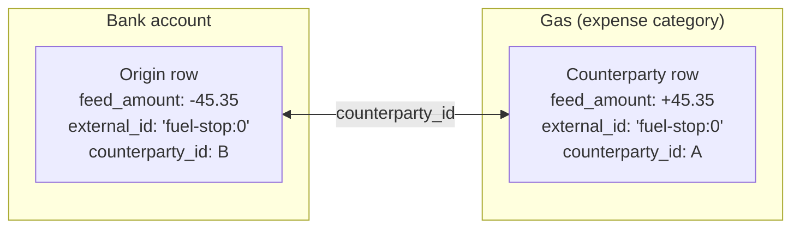
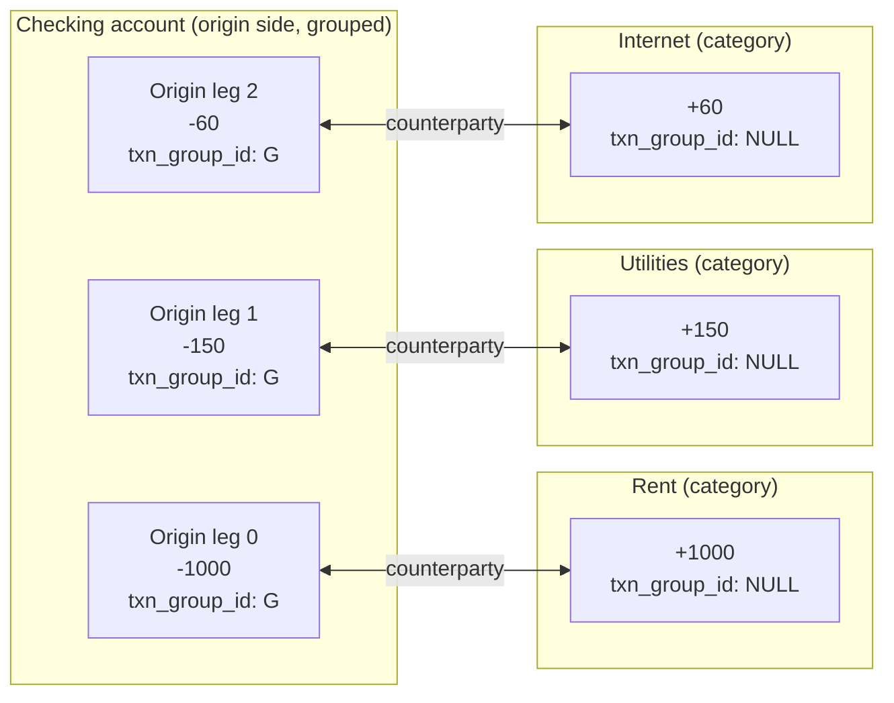
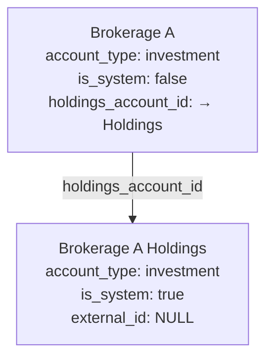
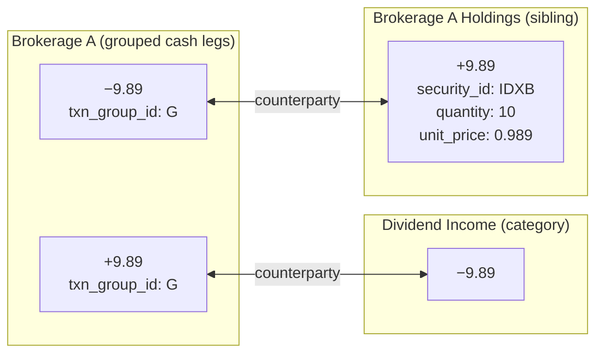

# 0019 — Symmetric postings: every flow is a row, paired by `counterparty_id`

* Status: Superseded by [ADR-0022](0022-txn-headers-and-legs.md) (2026-05-11)
* Date: 2026-05-09
* Refines: [ADR-0017](0017-account-discriminator.md), [ADR-0018](0018-investment-and-cross-account-translation.md)

> **Superseded.** The flat-row pairing model below was correct for what
> ADR-0019 set out to solve — uniform "other side of the flow" lookups —
> but pushed the event's envelope (payee/memo/date/status/check_number/
> import_source/is_pending/is_user_defined) onto every leg as a
> duplicated cell. Once group-level state (reconciliation, online-match,
> group memo) needed a home, the denormalization compounded. ADR-0022
> normalizes the schema into `txn_headers` + `txn_legs`, preserving this
> ADR's "uniform shape for every flow" principle while moving envelope
> metadata to the header. The rest of this document remains useful as
> historical context for *why* the symmetric-posting decomposition was
> chosen over the prior `splits` / shadow-row split.

## Context

ADR-0018 carried two concessions to the prior data model:

1. **Splits as the "other side" of single-account txns.** A non-investment
   transaction was one `transactions` row carrying the cash impact on the
   primary account, plus N `splits` rows naming the category targets.
   Cross-account transfers became *shadow* `transactions` rows linked by
   `external_id`. Two different relational shapes for "the other side of
   the flow," depending on whether the target was a category or a real
   account.
2. **`inv_txn_securities` for security metadata.** Investment txns kept
   their `transactions` row plus a satellite `inv_txn_securities` row for
   `security_id` / `quantity` / `unit_price` / `commission`. Triple-table
   reads to reconstruct one event.

Both concessions made the data layer harder to reason about — *"is this
flow's other side a split or a shadow row or an `inv_txn_securities`
row?"* depended on the txn's flavour. Reports, the running-balance
trigger, and any future reconciliation logic had to encode that branching
in three places.

The user's product call: switch to a strict double-entry view where every
flow is a `transactions` row, every row pairs with exactly one other row,
and the question "what's the other side of this posting" has one answer
schema-wide.

## Decision

### Rule 1 — Every flow is a `transactions` row

`splits` and `inv_txn_securities` are gone. Every Moneydance leg —
category leg, transfer leg, security leg, fee leg, dividend leg — emits a
`transactions` row on the affected account. There is one shape for "the
other side of a flow."

### Rule 2 — Every row pairs 1-1 via `counterparty_id`

`transactions.counterparty_id UUID NOT NULL` references another
`transactions.id`. The pairing is symmetric: if row A's counterparty is
B, then B's counterparty is A.

The FK is `DEFERRABLE INITIALLY DEFERRED` so paired inserts within one
transaction can reference each other before either side resolves; both
sides commit together. A constraint trigger
`fn_validate_counterparty_symmetric` (also deferred) enforces the A↔B
symmetric invariant at COMMIT.

### Rule 3 — Multi-leg events share `txn_group_id` on the origin side only

When one user-facing event touches multiple categories or accounts (a
"split transaction"), the origin-side rows on the source account share a
fresh `txn_group_id`. The counterparty rows on the target accounts are
*not* grouped — each target's register shows the leg as a standalone
posting paired bidirectionally with its origin.

This is "UI sugar," not a structural commitment. The register collapses
grouped origin rows behind a single "split transaction" row by default;
the counterparty rows always render as standalone register entries.

### Rule 4 — Per-brokerage Holdings sibling account

Investment transactions split cleanly into two flows: cash on the
brokerage and an asset position on a holdings-side account. Per ADR-0018,
the cash side is the brokerage account itself (`account_type='investment'`).
For the holdings side we introduce a system-managed sibling account per
brokerage:

The sibling sits at the root (`parent_id IS NULL`), preserving the
ADR-0017 invariant that real accounts don't form a hierarchy. A new
self-FK `accounts.holdings_account_id` on the brokerage row points at the
sibling; `is_system=TRUE` marks it as system-managed so the user UI hides
it by default. The sibling is created on demand by the importer
(`AccountsRepository.EnsureHoldingsSiblingAsync`) and is idempotent across
re-runs.

### Rule 5 — Investment-txn shapes decompose into 1, 2, or 4 paired rows

Security metadata (`security_id`, `quantity`, `unit_price`, `commission`)
moves onto `transactions` directly and lives on the **holdings-side row**
of each pair. The per-shape decomposition:

| MD shape | Pairs | Brokerage cash row(s) | Other side | Holdings/lots |
|---|---|---|---|---|
| `(buy, xfrtp_buysell)` | 1–N | One cash row per leg (sec + each fee), grouped if N>1 | sec → Holdings sibling; fee → fee category | qty + cost basis (price + commission) |
| `(sell, xfrtp_buysell)` | 1–N | Same shape as buy | Holdings sibling (negative qty) | qty − ; cost basis deferred |
| `(buyx, xfrtp_buysellxfr)` | 1 | *None* (no cash flows through brokerage) | Holdings sibling ↔ external account | qty + cost basis |
| `(sellx, xfrtp_buysellxfr)` | 1 | *None* | Holdings sibling ↔ external account | qty − |
| `(div, xfrtp_dividend)` | 1 | One cash row, `security_id` pinned for per-security register | income category | unchanged |
| `(divr, xfrtp_dividend)` | 2 | Two cash rows, grouped (inc + sec, net 0) | income category + Holdings sibling | qty + cost basis (gross dividend) |
| `(divx, xfrtp_dividendxfr)` | 2 | Two cash rows, grouped (inc + xfr, net 0) | income category + external account | unchanged |
| `(bank, xfrtp_bank)` | 1 | One cash row | external account | unchanged |
| `(inc, xfrtp_miscincexp)` | 1–N | One cash row per inc/fee leg, grouped if N>1 | income / fee category | unchanged |

The marquee 4-row case is `divr` — dividend reinvested into more shares.
Two pairs, four rows; the brokerage's cash leg nets to zero:

### Rule 6 — Leg-suffixed `external_id` keys idempotency per leg

Each row's `external_id` is `<md_txn_id>:<leg_index>` where `leg_index` is
the original Moneydance split index. The partial unique index
`(account_id, external_id) WHERE external_id IS NOT NULL` keys idempotency
per *leg* per *account*: re-running the importer hits ON CONFLICT for
every leg, no matter how many splits target the same category in one MD
event.

### Rule 7 — Pair-linkage columns are set-once on insert

`counterparty_id`, `txn_group_id`, and `accounts.holdings_account_id` are
established on the initial INSERT and **never refreshed on conflict-update**.
The mapper generates fresh GUIDs on every pass with no awareness of what's
already persisted; refreshing those columns from the proposed-but-discarded
new ids would point each row at a sibling that never gets inserted. The
deferred symmetric-pairing trigger catches this at COMMIT — and does, in
the regression tests.

## Consequences

**Positive**
- One shape for "the other side of a flow." The running-balance trigger,
  the resolved view, every report, and any future reconciliation logic
  query a single table with one set of column semantics.
- The double-entry invariant is enforced by the database. Asymmetric
  pairings can't survive a COMMIT.
- The investment register query is straightforward — `WHERE security_id =
  X` returns dividends, buys, sells, and reinvests in chronological order
  without joining a satellite table.
- Re-running the importer is fully idempotent. Validated end-to-end against
  a large real-world MD export: well over a hundred thousand rows on first
  run, identical counts on re-run, zero asymmetric pairs, zero dangling FKs.

**Negative**
- Row count grows. A simple expense becomes 2 rows; a 3-way split becomes
  6; a divr becomes 4. The tens of thousands of MD txns in a large
  real-world MD export expand to well over a hundred thousand Coffer rows.
  Storage and index size scale linearly; the running-balance trigger fires
  once per chunk per affected account regardless.
- The "split transaction" UI must collapse origin-side rows by
  `txn_group_id`. The data layer doesn't enforce that grouping; it's a UI
  convention.
- The Holdings sibling account adds one row per brokerage that the user
  doesn't directly manage. `is_system=TRUE` keeps it out of normal lists,
  but its existence is observable in account counts.

## Alternatives considered

- **Keep `splits` for category legs; use shadow rows only for non-category
  transfers.** The pre-ADR-0019 model. Two relational shapes, branching
  in every consumer. Rejected by the user: *"we have the double-entry
  model; I thought it was an assumption. What are the gaps assuming we
  switch to a symmetric view? Don't let supposed UI layouts drive data
  store decisions."*
- **Place security metadata on the brokerage cash row instead of a
  dedicated Holdings sibling.** Considered. Rejected because it puts
  asset-position state on a cash account, breaking the running-balance
  semantics (cash side is dollars, asset side is shares × price). A
  separate sibling account makes each register's semantic crisp.
- **Use a `txn_pair_id` column to group both sides of a pair.** Equivalent
  in expressiveness to `counterparty_id` but loses the bidirectional
  linkage that makes the "other side of this row" query a single join.
  Rejected.
- **Make `txn_group_id` apply to both origin and counterparty rows of a
  multi-leg event.** Considered. Rejected by the user: *"the group idea
  is only applied to the postings from the originating account; the
  postings in the target account are usually not grouped."* Counterparty
  rows belong to their target account's register and should stand alone
  there.
- **Store a single `pair_id` UUID once on the origin side, materialise the
  counterparty's reference via a view.** Loses the symmetric-trigger
  enforcement and complicates the per-row counterparty lookup. Rejected.
